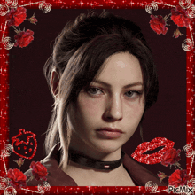

  

  

  
  

  

Oi, eu sou a **Alice**, tenho 18 anos e estudo Engenharia de Software na Uniceplac. Estou começando a programar e ainda estou no começo, mas sou apaixonada por tecnologia e jogos. No momento estou estudando Java e uso o VS Code para escrever meus códigos. Quero ir evoluindo a cada projeto.

 
 
 
 
 

 

  

  

  
  
  
  

  

  

  

  
  

  

  

  

❤️

